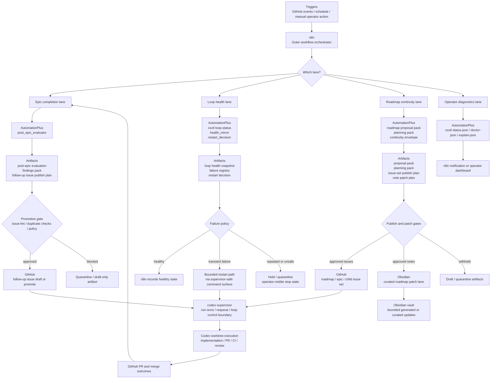

# AutomationPlus

AutomationPlus is the meta-orchestration layer that sits beside `codex-supervisor` for trusted solo, issue-driven development.

It does not replace the supervisor's core PR / CI / merge execution lane. Instead, it adds bounded automation around:

- Epic completion evaluation and follow-up issue drafting
- loop observation, restart decisioning, and failure routing
- roadmap continuity planning and issue-set publish planning
- generated Obsidian sync and curated roadmap note patching

The design goal is to automate useful operator work without widening the execution boundary more than necessary.

## What Exists Today

At the current stage, this repository provides:

- `csctl`, a small wrapper that exposes read-only diagnostics plus a limited set of safe supervisor mutations
- loop observation artifacts such as `loop-status`, health snapshots, failure signatures, and restart decisions
- post-Epic evaluation artifacts, findings packs, roadmap proposal packs, planning packs, and roadmap continuity issue-set publish plans
- bounded Obsidian output lanes for generated notes and curated roadmap note patches
- regression-focused unit tests covering the artifact contracts and safety boundaries above

In practice, AutomationPlus is the "meta lane" around `codex-supervisor`, not a second supervisor.

## n8n-Centered Workflow

The repository does not bundle an n8n workflow export today, but the intended operating model is that n8n acts as the outer orchestrator around the artifact and CLI surfaces implemented here.

Read the diagram below as:

- `n8n` owns trigger routing, scheduling, and cross-system wiring
- `AutomationPlus` owns bounded artifact generation, policy checks, and note/output contracts
- `codex-supervisor` owns the durable issue execution loop, PR lifecycle, and worktree-based implementation lane
- `Obsidian` and `GitHub` stay outside the core execution lane and are only touched through explicit gates



### What This Means In Practice

If you think about the whole system from the outside, n8n is the conductor and AutomationPlus is the contract-heavy policy engine sitting between n8n and the rest of the dev workflow.

- n8n decides when a workflow should run
- AutomationPlus decides what artifact or bounded action is safe to emit
- `codex-supervisor` decides how implementation work advances through issues, PRs, CI, and review

That split matters because it keeps "workflow glue" separate from "trusted execution boundaries".

### Current Implementation Status

At this point, the repository already implements most of the AutomationPlus boxes in the diagram:

- Epic completion lane:
  post-Epic evaluation, findings packs, and follow-up issue publish planning are implemented.
- Loop health lane:
  `csctl loop-status`, failure classification, restart decisioning, and bounded stop/hold routing are implemented.
- Roadmap continuity lane:
  roadmap proposal packs, planning packs, continuity envelopes, issue-set publish planning, and curated note patch planning are implemented.
- Obsidian outputs:
  generated sync and curated roadmap note patch application are implemented with path and safety policies.

The part that is still intentionally external is the n8n workflow definition itself. This README section describes how n8n should sit around the current repository capabilities, not a bundled workflow file shipped inside this repo.

## Repository Layout

- `automationplus/`
  Core implementation modules.
- `tests/`
  Unit tests for artifact builders, control logic, and safety constraints.
- `csctl`
  Thin CLI entrypoint into `automationplus.csctl`.
- `docs/launcher-service-contract.md`
  Read-only loop observation contract for `csctl loop-status`.
- `.codex-supervisor/config.json`
  Repo-local backend mapping used by `csctl`.

## Main Concepts

### `csctl`

`csctl` is the local command surface for interacting with AutomationPlus in a bounded way.

Currently supported commands are:

- `status-json`
- `doctor-json`
- `explain-json`
- `issue-lint-json`
- `loop-status`
- `restart-decision`
- `run-once`
- `requeue`
- `prune-orphaned-workspaces`
- `reset-corrupt-json-state`

Read-only diagnostics are preferred by default. Mutation commands are intentionally limited and validated.

### Loop Observation

`csctl loop-status` is the read-only observation boundary for the AutomationPlus loop. It reports:

- top-level loop health: `healthy`, `degraded`, `off`, or `unknown`
- failure policy and stable failure signatures
- tmux runtime metadata
- mirrored supervisor state
- launcher/service metadata when available

The launcher/service trust model is documented in [docs/launcher-service-contract.md](docs/launcher-service-contract.md).

### Artifact-First Automation

Most higher-level behaviors are implemented as explicit artifacts, not hidden workflow state. Examples include:

- post-Epic evaluation artifacts
- findings packs
- follow-up issue publish plans
- roadmap proposal packs
- planning packs
- continuity envelopes
- roadmap continuity issue-set publish plans
- roadmap continuity note patch plans
- restart decision artifacts
- Obsidian generated-sync and curated-patch result artifacts

This keeps review, testing, and later automation tied to durable contracts.

## Safety Model

AutomationPlus is deliberately conservative.

- It assumes a trusted local operator and trusted repository inputs.
- It keeps generated note writes and curated note patches inside explicit path policies.
- It fails closed when artifact state, budget state, or note patch conditions are not trustworthy.
- It separates "artifact generation" from "publish/apply" decisions whenever crossing an external boundary would be riskier.

Two examples:

- generated Obsidian writes are limited to approved generated-note roots
- curated note patches require an approved note-patch artifact and are constrained to roadmap paths plus exact replace semantics

## Quick Start

### 1. Run the test suite

```bash
python3 -m unittest discover -s tests -v
```

### 2. Try the local CLI

From the repository root:

```bash
./csctl status-json
./csctl doctor-json
./csctl loop-status
```

If you need a different backend config:

```bash
./csctl status-json --config /path/to/config.json
```

### 3. Inspect the repo-local backend mapping

`csctl` uses `.codex-supervisor/config.json` by default when no `--config` override is supplied.

## Testing

CI currently runs on Python `3.9` and `3.12` and performs:

- byte-compilation of `automationplus`, `tests`, `csctl`, and `scripts/diagnostics_backend.py`
- `python -m unittest discover -s tests -v`

Local verification usually mirrors that same command.

## Relationship To `codex-supervisor`

AutomationPlus should be read as an add-on layer around a separately managed `codex-supervisor` checkout.

- `codex-supervisor` owns the durable issue execution loop, PR lifecycle, CI/review reconciliation, and worktree orchestration
- AutomationPlus consumes and shapes metadata around that loop
- AutomationPlus should avoid duplicating the supervisor's same-PR repair lane or local review swarm responsibilities

If a feature seems like "core issue execution", it probably belongs in `codex-supervisor`.
If it seems like "meta automation around the execution lane", it probably belongs here.

## Current Scope Boundaries

Things AutomationPlus does focus on:

- meta evaluation after work completes
- bounded service observation and recovery signals
- roadmap continuity planning
- bounded note generation and curated patching

Things it intentionally does not try to own:

- replacing the supervisor loop itself
- broad, unbounded vault mutation
- implicit publish decisions without artifact-backed gates
- generic workflow automation outside the trusted local development lane

## Documentation

- [docs/launcher-service-contract.md](docs/launcher-service-contract.md)

Additional architecture and rollout context currently lives in the accompanying Obsidian project notes used for this repository.
